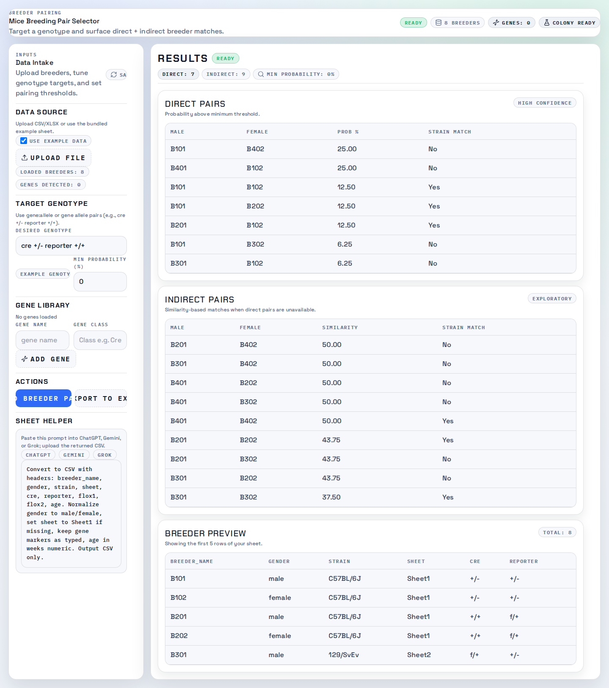

# Breeder Pair Selector

Modern React + FastAPI web app for pairing mouse breeders from colony spreadsheets. Styling matches the lab notebook neo-brutalist system. Use the bundled example dataset for a zero-upload demo or bring your own CSV/XLSX. The old PyQt desktop UI is archived in `LEGACY.md`.

## Project layout
- `modern-app/src` – React (Vite + TypeScript + Tailwind)
- `modern-app/backend` – FastAPI service with pairing logic and Excel export
- `modern-app/example_data/animals.csv` – Bundled dataset used by example mode
- `modern-app/screenshots/example_run.png` – Latest UI snapshot (generated by E2E on Dec 28, 2025)
- `LEGACY.md` – Notes for the unmaintained PyQt desktop app

## Features
- Upload CSV/XLSX (multi-sheet supported) and normalize to breeders + gene catalog
- Toggle **Use Example Data** to explore without providing files
- Manage gene classes (Cre/Reporter/Flox) through the backend APIs
- Compute direct and indirect breeder pairs with optional minimum probability filter
- Export results as an Excel workbook (direct + indirect sheets)
- Playwright end-to-end test covers the example flow and refreshes the screenshot

## Quick start (dev)
```bash
cd modern-app
npm install
pip install -r backend/requirements.txt

# in one terminal
npm run dev:back   # FastAPI on http://localhost:8002

# in another terminal
npm run dev:front  # Vite on http://localhost:5174
```

Open http://localhost:5174, enable **Use Example Data**, enter a desired genotype (e.g., `cre +/- reporter +/+`), then click **Find Breeder Pairs**. Use **Export Pairs** to download the Excel workbook.

## Tests & screenshot refresh
```bash
cd modern-app
npx playwright install --with-deps chromium
npm run test:e2e
```
This drives the example flow and regenerates `modern-app/screenshots/example_run.png`.

## Screenshot


## Legacy desktop
The previous PyQt application is no longer shipped. For historical notes, see `LEGACY.md`.

## License
MIT License. See `LICENSE`.

## Contact
Meghamsh Teja Konda — meghamshteja555@gmail.com | https://x.com/MeghamshTeja
